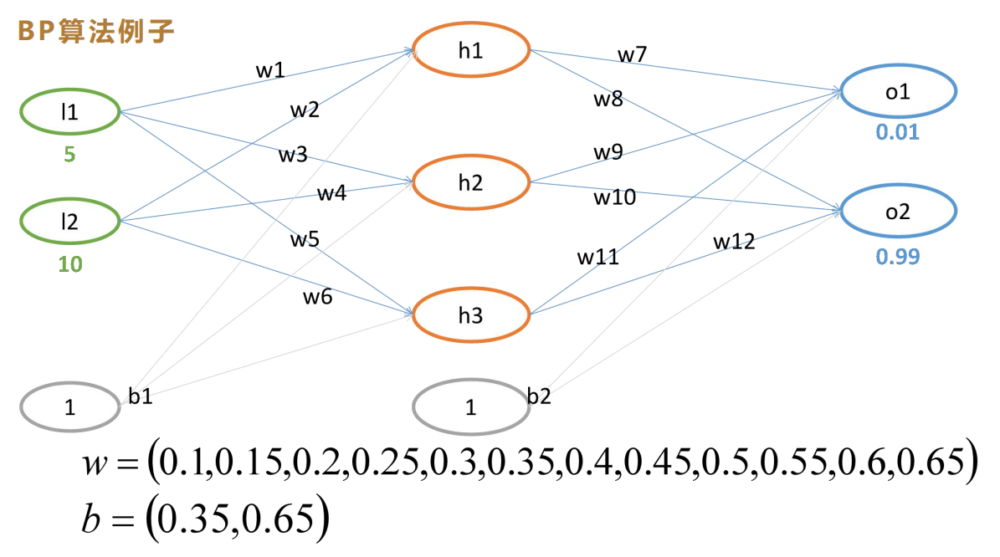
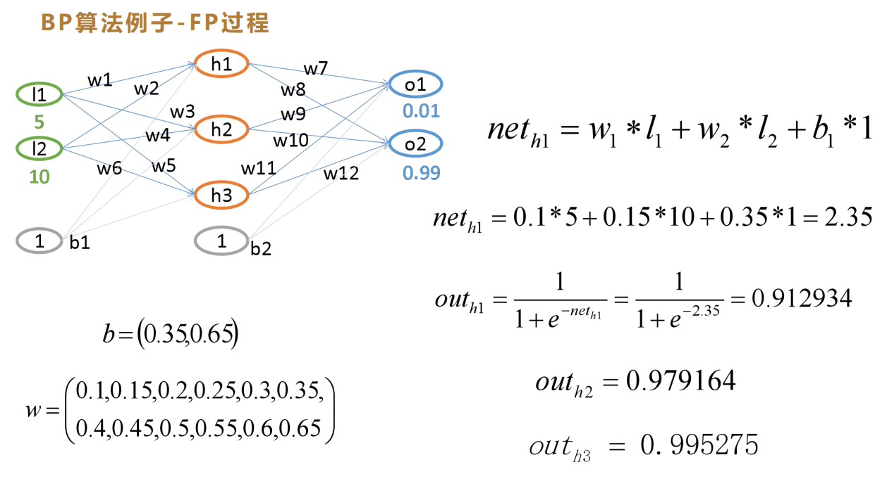
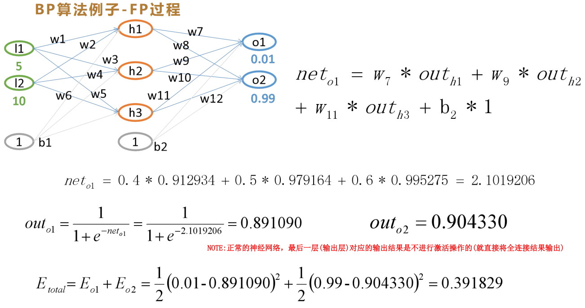
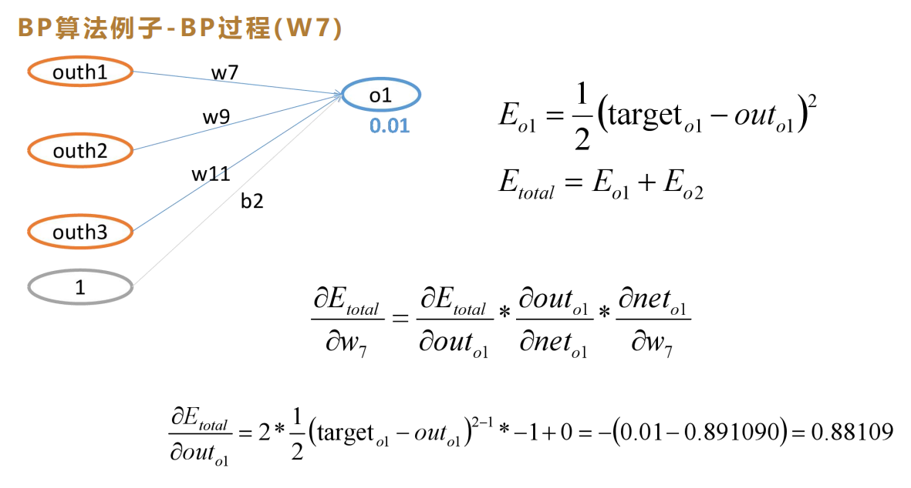
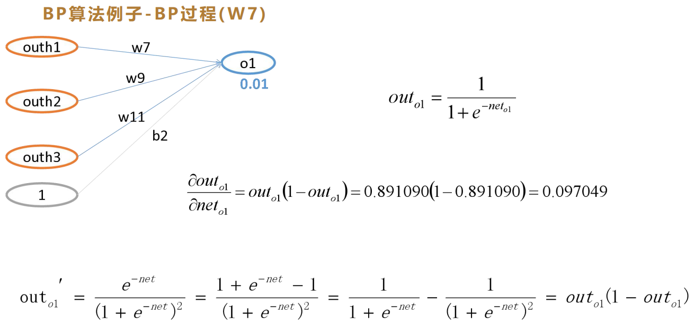
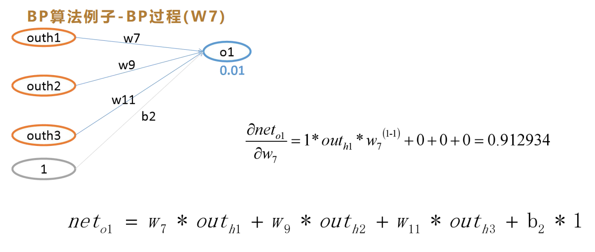

## 一、网络结构与基础参数

本文以一个**2输入、3隐藏神经元、2输出**的浅层全连接神经网络为例，完整推导前向传播（FP）、损失计算、反向传播（BP）的全过程。网络激活函数统一使用Sigmoid，损失函数采用带1/2系数的均方误差（MSE）。

### 1. 各层参数说明
- **输入层**：2个输入特征 $l_1=5$，$l_2=10$
- **隐藏层**：3个神经元 $h_1、h_2、h_3$，偏置 $b_1=0.35$（偏置输入恒为1）
- **输出层**：2个神经元 $o_1、o_2$，偏置 $b_2=0.65$；真实标签（目标值）为 $target_{o1}=0.01$，$target_{o2}=0.99$
- **权重矩阵**：
  - 输入层→隐藏层权重（$w_1 \sim w_6$）：`[0.1, 0.15, 0.2, 0.25, 0.3, 0.35]`
  - 隐藏层→输出层权重（$w_7 \sim w_{12}$）：`[0.4, 0.45, 0.5, 0.55, 0.6, 0.65]`

### 2. 计算流程总览
1. **前向传播**：从左到右，逐层计算神经元的加权净输入，再通过激活函数得到输出
2. **损失计算**：用预测输出和真实标签计算总误差
3. **反向传播**：从右到左，通过链式求导法则，计算每个权重对总损失的梯度，用于后续权重更新

---

## 二、前向传播（Forward Propagation）完整过程

前向传播的核心是**线性加权求和 + 非线性激活**，逐层从输入传递到输出。

### 1. 隐藏层计算

#### （1）净输入（加权求和）
神经元净输入公式：$net = \sum (输入 \times 权重) + 偏置$

以 $h_1$ 为例：
$$net_{h1} = w_1 \times l_1 + w_2 \times l_2 + b_1 \times 1$$
代入数值：
$$net_{h1} = 0.1\times5 + 0.15\times10 + 0.35\times1 = 2.35$$

同理计算另外两个隐藏神经元：
$$
net_{h2} = 0.2\times5 + 0.25\times10 + 0.35 = 3.85
$$
$$
net_{h3} = 0.3\times5 + 0.35\times10 + 0.35 = 5.35
$$

#### （2）Sigmoid激活输出
激活函数采用Sigmoid，公式为 $out = \frac{1}{1+e^{-net}}$，将净输入映射到(0,1)区间。

$$
out_{h1} = \frac{1}{1+e^{-2.35}} \approx 0.912934
$$
$$
out_{h2} = \frac{1}{1+e^{-3.85}} \approx 0.979164
$$
$$
out_{h3} = \frac{1}{1+e^{-5.35}} \approx 0.995275
$$

### 2. 输出层计算

隐藏层的输出作为输出层的输入，重复「加权求和 + 激活」的流程。

#### （1）净输入（加权求和）
以 $o_1$ 为例：
$$
net_{o1} = w_7 \times out_{h1} + w_9 \times out_{h2} + w_{11} \times out_{h3} + b_2 \times 1
$$
代入数值：
$$
net_{o1} = 0.4 \times 0.912934 + 0.5 \times 0.979164 + 0.6 \times 0.995275 = 2.1019206
$$

#### （2）Sigmoid激活输出
$$
out_{o1} = \frac{1}{1+e^{-2.1019206}} \approx 0.891090
$$
同理可得：
$$
out_{o2} \approx 0.904330
$$

> 补充说明：回归任务的输出层通常不使用激活函数，直接输出加权和；本例为完整演示带激活函数的反向传播推导，输出层保留了Sigmoid激活，符合二分类任务的输出层设计。

---

## 三、损失函数计算
本例使用<strong>带1/2系数的均方误差（MSE）</strong>作为损失函数，用于量化预测值与真实值的差距。

### 1. 损失函数定义
单样本总损失为所有输出节点的误差之和：
$$
E_{total} = \sum_{i=1}^n E_i = \sum_{i=1}^n \frac{1}{2}\left(target_i - out_i\right)^2
$$

公式中1/2 的作用：反向传播求导时，平方项的导数系数2会与1/2抵消，简化梯度计算公式，且不影响损失的相对大小和权重更新方向。

### 2. 分步计算
已知：$target_{o1}=0.01$，$out_{o1}=0.891090$；$target_{o2}=0.99$，$out_{o2}=0.904330$

#### （1）o1节点的误差
$$
\begin{aligned}
E_{o1} &= \frac{1}{2}\left(target_{o1} - out_{o1}\right)^2 \\
&= \frac{1}{2} \times (0.01 - 0.891090)^2 \\
&\approx 0.388160
\end{aligned}
$$

#### （2）o2节点的误差
$$
\begin{aligned}
E_{o2} &= \frac{1}{2}\left(target_{o2} - out_{o2}\right)^2 \\
&= \frac{1}{2} \times (0.99 - 0.904330)^2 \\
&\approx 0.003670
\end{aligned}
$$

#### （3）总损失
$$
E_{total} = E_{o1} + E_{o2} \approx 0.388160 + 0.003670 = 0.391829
$$

---

## 四、反向传播（Back Propagation）链式求导

反向传播的核心是**多元复合函数的链式求导法则**：从总损失出发，从右往左逐层传递误差，计算每个权重对总损失的梯度，为梯度下降更新权重提供依据。

本例以权重 $w_7$ 为例，完整推导梯度计算过程。

### 1. 链式求导的拆分逻辑
权重 $w_7$ 到总损失的依赖链条为：
$$w_7 \xrightarrow{\text{影响}} net_{o1} \xrightarrow{\text{影响}} out_{o1} \xrightarrow{\text{影响}} E_{total}$$

根据链式求导法则，总损失对 $w_7$ 的偏导可拆分为三项导数的乘积：
$$
\frac{\partial E_{total}}{\partial w_7} = \frac{\partial E_{total}}{\partial out_{o1}} \times \frac{\partial out_{o1}}{\partial net_{o1}} \times \frac{\partial net_{o1}}{\partial w_7}
$$

### 2. 逐项推导与计算
#### （1）第一项：$\boldsymbol{\frac{\partial E_{total}}{\partial out_{o1}}}$
**物理意义**：输出值 $out_{o1}$ 每变化1单位，总损失的变化量。

总损失 $E_{total} = E_{o1} + E_{o2}$，其中 $E_{o2}$ 与 $out_{o1}$ 无关，偏导为0，因此：
$$
\frac{\partial E_{total}}{\partial out_{o1}} = \frac{\partial E_{o1}}{\partial out_{o1}}
$$

代入损失函数求导（幂函数求导 + 内层链式法则）：
$$
\frac{\partial E_{o1}}{\partial out_{o1}} = 2 \times \frac{1}{2}(target_{o1} - out_{o1}) \times (-1) = out_{o1} - target_{o1}
$$

代入数值：
$$
\frac{\partial E_{total}}{\partial out_{o1}} = 0.891090 - 0.01 = 0.88109
$$

#### （2）第二项：$\boldsymbol{\frac{\partial out_{o1}}{\partial net_{o1}}}$

**物理意义**：净输入 $net_{o1}$ 每变化1单位，激活后输出值的变化量，即Sigmoid函数的导数。

Sigmoid函数的导数有简洁性质：$\sigma'(x) = \sigma(x)(1-\sigma(x))$，因此：
$$
\frac{\partial out_{o1}}{\partial net_{o1}} = out_{o1} \times (1 - out_{o1})
$$

代入数值：
$$
\frac{\partial out_{o1}}{\partial net_{o1}} = 0.891090 \times (1 - 0.891090) \approx 0.0971
$$

> 该性质是反向传播高效的核心：可以直接复用前向传播的输出值计算导数，无需重复计算指数项。

#### （3）第三项：$\boldsymbol{\frac{\partial net_{o1}}{\partial w_7}}$

**物理意义**：权重 $w_7$ 每变化1单位，净输入 $net_{o1}$ 的变化量。

净输入公式中，仅第一项包含 $w_7$，其余项与 $w_7$ 无关，偏导为0，因此：
$$
\frac{\partial net_{o1}}{\partial w_7} = out_{h1}
$$

代入数值：
$$
\frac{\partial net_{o1}}{\partial w_7} = 0.912934
$$

### 3. 最终梯度结果
将三项相乘，得到总损失对 $w_7$ 的梯度：
$$
\begin{aligned}
\frac{\partial E_{total}}{\partial w_7} &= 0.88109 \times 0.0971 \times 0.912934 \\
&\approx 0.0781
\end{aligned}
$$

得到梯度后，即可通过梯度下降公式更新权重：
$$
w_7^{new} = w_7^{old} - \eta \times \frac{\partial E_{total}}{\partial w_7}
$$
其中 $\eta$ 为学习率，控制权重更新的步长。

---

## 五、Sigmoid激活函数详解
### 1. 数学定义
Sigmoid（逻辑函数）是经典的S型激活函数，表达式为：
$$
\sigma(x) = \frac{1}{1 + e^{-x}}
$$

### 2. 核心性质
- **值域固定**：输出恒落在 $(0,1)$ 区间，天然适配概率表示、数据归一化场景
- **连续可导**：函数处处光滑可导，导数形式简洁，便于反向传播计算
- **单调性**：函数单调递增，$x=0$ 处输出为0.5；输入越大输出越接近1，输入越小输出越接近0

### 3. 导数公式
$$
\sigma'(x) = \sigma(x) \times (1-\sigma(x))
$$

### 4. 优缺点与适用场景
- **优点**：输出范围可控、求导计算简单，是早期神经网络、二分类任务输出层的标准选择
- **缺点**：
  1. 易出现**梯度消失**：输入绝对值较大时，导数趋近于0，深层网络中梯度无法有效传递
  2. 输出非0均值，会降低梯度下降的收敛速度
- **现状**：深层网络中多被ReLU等激活函数替代，但仍是理解神经网络激活机制与BP算法的基础。

---

## 六、核心总结
1. 前向传播是「线性加权 + 非线性激活」的逐层传递过程，最终得到网络预测输出
2. 损失函数量化预测误差，带1/2系数的MSE是为了简化反向传播的求导公式
3. 反向传播的本质是链式求导，将总误差逐层反向传递，计算每个权重对损失的影响
4. Sigmoid的导数可通过自身输出直接计算，是反向传播高效实现的关键特性
5. 得到权重梯度后，即可通过梯度下降算法更新权重，迭代降低总损失
