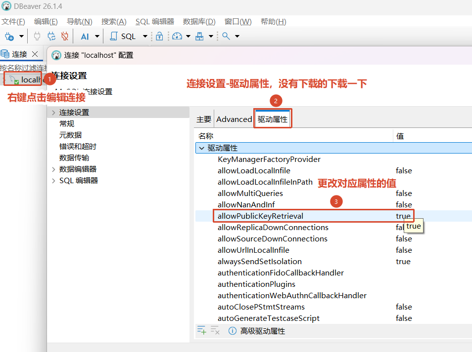

# MySQL

```shell
docker run -d `
  --name mysql8 `
  --restart always `
  -p 3306:3306 `
  -v D:\docker\mysql-data:/var/lib/mysql `
  -e MYSQL_ROOT_PASSWORD=Root@123456 `
  -e TZ=Asia/Shanghai `
  mysql:8.0
```


使用DBeaver连接MySQL的时候, MySQL‑8.0 默认认证默认账号插件：caching_sha2_password
需要在连接的驱动中进行设置

1. allowPublicKeyRetrieval = true
含义：允许 JDBC 主动从数据库获取 RSA 公钥
默认值：false（关闭）
DBeaver 底层是 Java‑JDBC 驱动，出于安全，默认禁止自动下载服务器公钥
拿不到公钥 → 没法加密密码 → 直接抛出报错 Public Key Retrieval is not allowed
打开这个参数，驱动就可以正常拿到公钥、加密密码、完成握手。
安全风险：中间人可以劫持公钥，属于开发环境可以妥协、公网生产环境不推荐开启。
2. useSSL = false
含义：关闭 SSL 加密通道
两条路线区分
开启 SSL（useSSL=true）
整条通信链路加密。SSL 通道建好之后，密码本身可以依靠通道保护，不需要 RSA 公钥加密密码。
但本地开发很多人环境没有配置证书，SSL 握手容易失败、超时、报错。
关闭 SSL（useSSL=false）
不走加密通道，这时就必须依靠 RSA 公钥单独加密密码。
所以你必须开启 allowPublicKeyRetrieval。

