绝大多数情况下我们会安装GPU版本的PyTorch。目前PyTorch不仅支持NVIDIA的GPU，还支持AMD的ROCm的GPU。

安装GPU版本的PyTorch步骤：

1. 根据NVIDIA驱动程序版本和要安装的PyTorch版本，确定安装哪个版本的CUDA。
2. 根据安装好的CUDA版本，安装对应版本的PyTorch。

# **1. GPU计算能力要求**

对于N卡，需要计算能力（compute capability）≥3.0。

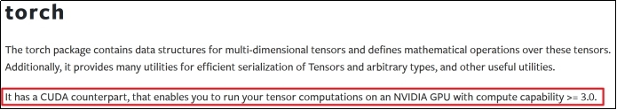 

可在[https://developer.nvidia.cn/cuda-gpus#compute](#compute)查看GPU计算能力。

# **2. CUDA版本选择**

CUDA（Compute Unified Device Architecture）是NVIDIA开发的并行计算平台和编程平台，允许开发者利用NVIDIA GPU的强大计算能力进行通用计算。CUDA不仅用于图形渲染，还广泛应用于科学计算、深度学习、金融建模等领域。

（1）根据NVIDIA驱动程序版本确定支持的最高CUDA版本

在命令行中输入nvidia-smi，在CUDA Version栏查看支持的最高CUDA版本。

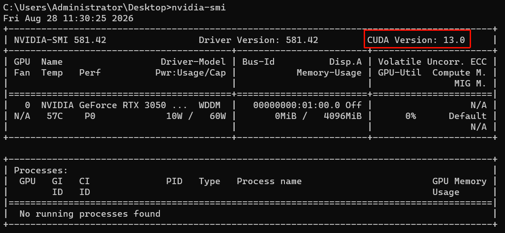

**根据PyTorch版本选择CUDA版本**

需要安装特定版本的CUDA版本，才能使用特定版本的PyTorch。在PyTorch下载页面可查看该版本PyTorch支持的CUDA版本。

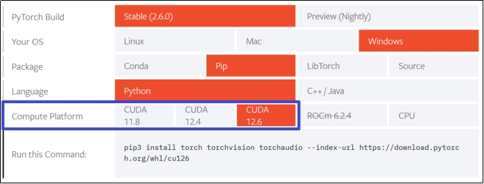

或在https://download.pytorch.org/whl/torch/查看过往版本PyTorch支持的CUDA版本。

例如：

 

此处的cu126表示支持CUDA12.6版本。

# 3. PyTorch安装

新建一个虚拟环境来安装PyTorch。

在命令行输入`conda create -n pytorch-2.6.0-gpu python=3.12`创建一个环境名为`pytorch-2.6.0-gpu`，Python版本为3.12的虚拟环境。

使用`conda activate pytorch-2.6.0-gpu`激活`pytorch-2.6.0-gpu`虚拟环境。

在官网https://pytorch.org/get-started选择要安装的版本，复制命令，在命令行中执行以安装PyTorch。

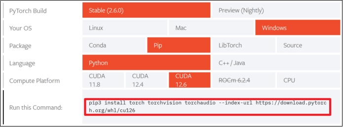 

若安装速度较慢或安装失败，可配置pip的国内镜像源`pip config set global.index-url https://pypi.tuna.tsinghua.edu.cn/simple`。

要在新的虚拟环境中使用Jupyter Notebook，需使用`conda install jupyter notebook`安装。

编写代码时需在IDE中选择新创建的虚拟环境作为Python解释器。

官方各版本2.6.0安装指令如下:

```shell
# ROCM 6.1 (Linux only)
pip install torch==2.6.0 torchvision==0.21.0 torchaudio==2.6.0 --index-url https://download.pytorch.org/whl/rocm6.1
# ROCM 6.2.4 (Linux only)
pip install torch==2.6.0 torchvision==0.21.0 torchaudio==2.6.0 --index-url https://download.pytorch.org/whl/rocm6.2.4
# CUDA 11.8
pip install torch==2.6.0 torchvision==0.21.0 torchaudio==2.6.0 --index-url https://download.pytorch.org/whl/cu118
# CUDA 12.4
pip install torch==2.6.0 torchvision==0.21.0 torchaudio==2.6.0 --index-url https://download.pytorch.org/whl/cu124
# CUDA 12.6
pip install torch==2.6.0 torchvision==0.21.0 torchaudio==2.6.0 --index-url https://download.pytorch.org/whl/cu126
# CPU only
pip install torch==2.6.0 torchvision==0.21.0 torchaudio==2.6.0 --index-url https://download.pytorch.org/whl/cpu
```

uv安装指令：

```shell
uv add torch==2.6.0 torchvision==0.21.0 torchaudio==2.6.0
```

# 4. CUDA安装（可选）

NVIDIA官网通常只展示最新的CUDA版本，过往CUDA版本可在https://developer.nvidia.com/cuda-toolkit-archive下载。

选择相应CUDA版本后，选择要安装的平台，Installer Type安装方式选择exe(local)本地安装。

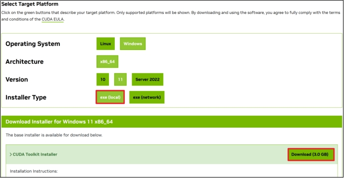 

双击.exe文件进行安装，首先需要输入临时解压路径，临时解压路径在安装结束后会自动被删除，保持默认即可。点击OK。

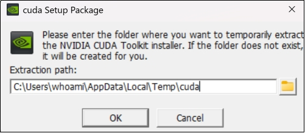

若在系统检查环节提示“您正在安装老版本的驱动程序…”，说明安装包中包含的驱动程序版本比当前已安装的驱动程序的版本旧，可忽略。点击继续。

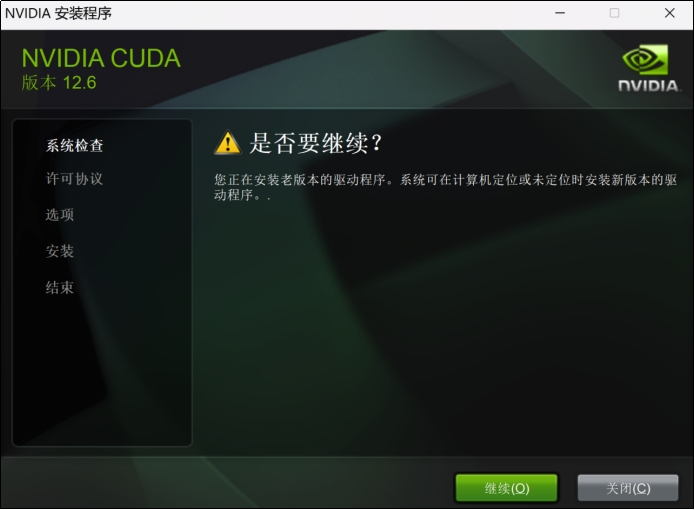 

同意安装协议并继续。

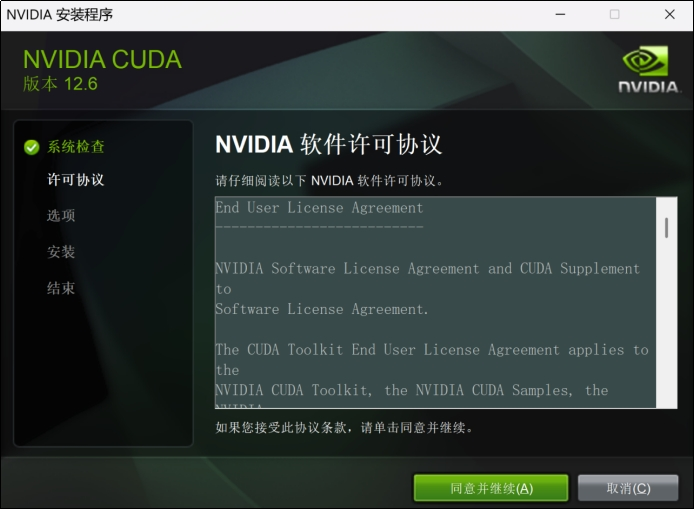

选择精简，会安装所有组件并覆盖现有驱动程序。点击下一步。

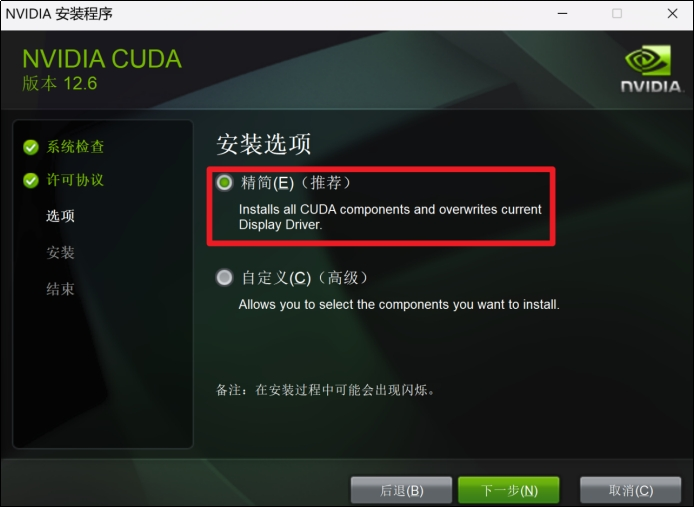

如果出现以下提示，表明缺少Visual Studio，部分组件不能正常工作。不用在意，选择I understand…。点击Next。

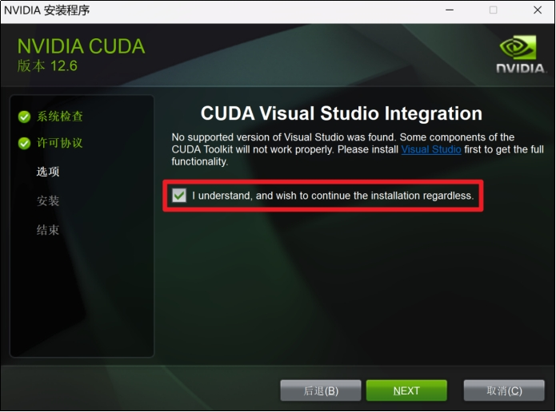 

点击下一步。

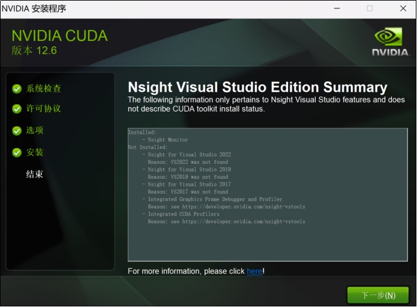

安装完成，点击关闭。

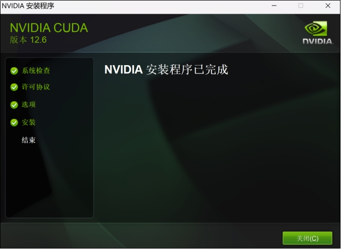 

可在命令行使用nvcc --version查看CUDA版本信息。

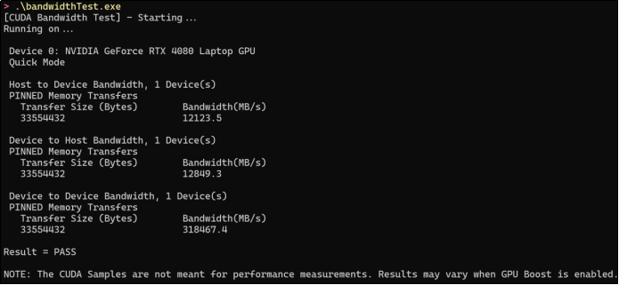
