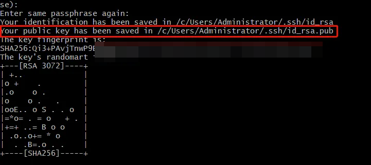
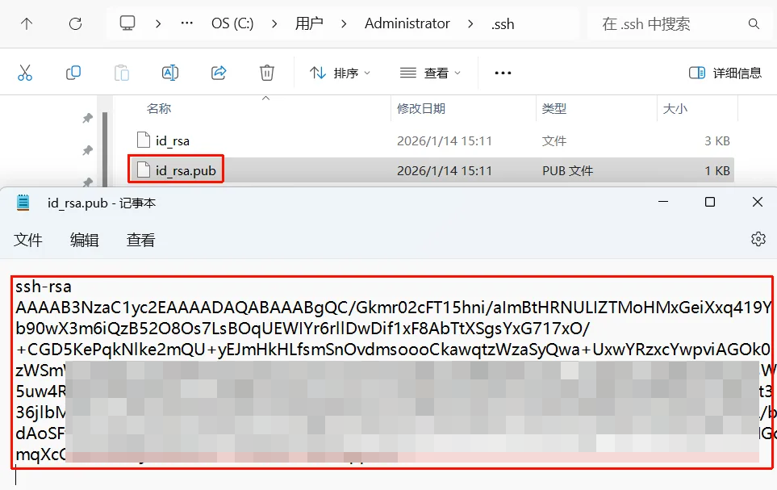

# 全局名称、全局邮箱

新安装好的git需要自己设置全局名称和全局邮箱

```shell
git config --global user.name "your_name"

git config --global user.email "your_email@example.com"
```

配置好之后可以通过指令检查(或者用下面的查询全局配置)

```shell
git config --global user.name
git config --global user.email
```

# 查询git全局配置

```shell
git config --global -l
```

# 设置本地GitHub加速端口

因为平时提交和拉取老是超时，所以需要进行代理，将访问GitHub链接的设置到本地的代理端口即可
```shell
git config --global http.https://github.com.proxy http://127.0.0.1:7890
```

# 生成ssh密钥并填写GitHub

可以在本地计算机上生成新的 SSH 密钥。生成密钥后，您可以将公钥添加到您在 GitHub/Gitee/Gitcode上的帐户，以启用通过 SSH 进行 Git 操作的身份验证。

1. 打开Git Bash，随便找个地方右键，Open Git Bash here
2. 请粘贴以下文本，并将示例中使用的邮件地址替换为你的常用邮件地址（最好是平台上使用的邮箱）。
```shell
ssh-keygen -t ed25519 -C "your_email@example.com"
```

> 如果您使用的是不支持 Ed25519 算法的旧系统，请使用：
	`ssh-keygen -t rsa -b 4096 -C "your_email@example.com"`

当系统提示“输入保存密钥的文件”时，您可以按**Enter 键**接受默认文件位置。请注意，如果您之前创建过 SSH 密钥，ssh-keygen 可能会要求您重写另一个密钥，在这种情况下，我们建议您创建一个自定义名称的 SSH 密钥。为此，请输入默认文件位置，并将 id_ALGORITHM 替换为您的自定义密钥名称。
```powershell
> Enter file in which to save the key (/c/Users/YOU/.ssh/id_ALGORITHM):[Press enter]
```
在提示符处，输入安全密码短语。有关更多信息，请参阅“[使用 SSH 密钥密码短语”](https://docs.github.com/en/authentication/connecting-to-github-with-ssh/working-with-ssh-key-passphrases)。
```shell
> Enter passphrase (empty for no passphrase): [Type a passphrase]
> Enter same passphrase again: [Type passphrase again]
```
不需要安全密码短语设置，这里直接回车就行了

生成完成之后会提示公钥被保存到指定的位置了

去对应的地址找到密钥复制


用该公钥去对应的仓库（GitHub、gitee、gitcode）中配置ssh即可

GitHub配置地址：[https://github.com/settings/ssh/new](https://github.com/settings/ssh/new)

Gitee配置地址：[https://gitee.com/profile/sshkeys](https://gitee.com/profile/sshkeys)

Gitcode配置地址：https://gitcode.net/-/profile/keys