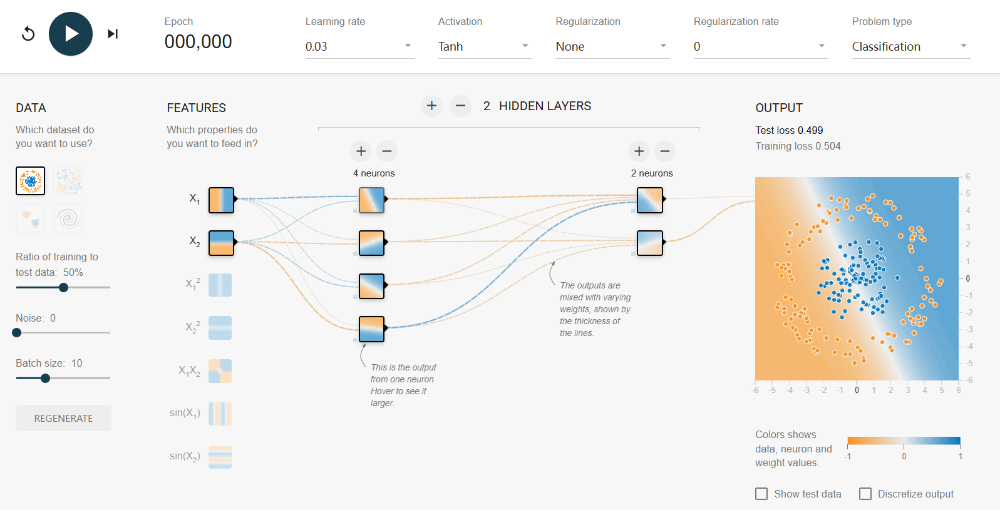

## 六个核心超参数速览

这六个超参数直接决定模型**学多久、学多快、怎么学、会不会学偏、解决什么问题**。

网址：https://playground.tensorflow.org

### 1. Epoch(训练轮数)
- **含义**：把全部训练数据完整喂给模型学习一遍，称为 1 个 Epoch。
- **图中初始值**：000,000（可调节输入框，尚未开始训练）
- **影响**：
  - 太小 → 欠拟合，连训练数据都没掌握。
  - 太大 → 过拟合，把训练数据“背”下来，新数据表现差。
- **举例**：1000 条数据，每轮全学完算 1 个 Epoch；100 个 Epoch 就是反复学 100 遍。

### 2. Learning rate(学习率)
- **含义**：模型每次更新参数时“步子迈多大”，即学习的快慢。
- **图中取值**：0.03
- **影响**：
  - 太大 → 震荡甚至发散，越学越差。
  - 太小 → 收敛极慢，训练耗时且可能陷入局部最优。
- **补充**：0.03 属于中等偏小学习率，搭配 Tanh 激活函数较稳妥，不易梯度爆炸。

### 3. Activation(激活函数)
- **含义**：为神经元引入**非线性**，让多层网络能学习复杂规律。
- **图中取值**：Tanh（双曲正切）
- **Tanh 特点**：输出范围 (-1, 1)，零中心，比 Sigmoid 收敛快；但在深层网络中易发生**梯度消失**，浅层或简单分类任务仍常用。
- **常见替代**：Sigmoid、ReLU、LeakyReLU、Softmax 等。

### 4. Regularization(正则化)
- **含义**：给模型加**惩罚约束**，防止死记硬背训练数据（过拟合），提升泛化能力。
- **图中取值**：None
- **常见方法**：L1 正则、L2 正则、Dropout 等。
- **何时开启**：训练集准确率很高但测试集效果暴跌时，需要加正则化。

### 5. Regularization rate(正则化系数)
- **含义**：正则化的惩罚强度，数值越大约束越狠。
- **图中取值**：0（因为正则化选 None，系数自然为 0）
- **影响**：
  - 太大 → 欠拟合，模型被“管死”，学不到有效规律。
  - 太小 → 惩罚不足，起不到防过拟合作用。
- **示例**：L2 正则 + rate=0.001，损失额外加 `0.001 × 所有权重的平方和`。

### 6. Problem type(问题类型)
- **含义**：定义模型解决的任务类别，决定输出层结构与损失函数。
- **图中取值**：Classification（分类任务）
- **常见类型**：
  - **Classification**：输出类别概率，如垃圾邮件识别、图片分类，搭配 Softmax + 交叉熵。
  - **Regression**：输出连续数值，如房价、销量预测。

---

## 正则化深度解析

### 一、正则化到底干什么
正则化的核心作用：**防止过拟合，提升模型对新数据的泛化能力**。

- **过拟合**：模型死记训练数据中的噪声和偶然细节，训练集表现极好，测试集表现差。
- **正则化**：施加约束，迫使模型学习更通用、更本质的规律，而不是记住数据本身。

### 二、为什么说它是“惩罚机制”
模型训练目标是最小化**损失函数**。

- **无正则化**：
  $$\text{总损失} = \text{预测误差损失}$$
  模型会不顾一切拟合训练数据，权重可能变得极端，导致过拟合。

- **有正则化**：
  $$\text{总损失} = \text{预测误差损失} + \lambda \times \text{惩罚项}$$
  - $\lambda$ 为 **Regularization rate（惩罚强度）**；
  - 惩罚项与模型权重大小挂钩：权重越极端，惩罚越重。

模型为降低总损失，必须同时兼顾预测准确与权重平缓，**主动压制复杂、极端的参数**，从而实现“惩罚”目的。

### 三、L1与L2正则化怎样“惩罚”
#### 1. L2正则化（权重衰减）
- **惩罚项**：所有权重的**平方和**
- **效果**：权重大小被均匀压缩，避免个别特征权重过大主导结果。
- **类比**：要求解题步骤平稳、通用，不能太偏门。

#### 2. L1正则化
- **惩罚项**：所有权重的**绝对值和**
- **效果**：让大量不重要的特征权重直接变为 0，自带**特征选择**功能，使模型更稀疏、更简单。

> 图中 Regularization = None，rate = 0，即无任何惩罚，模型仅追求训练集准确率，过拟合风险较高。

### 四、一句话总结
正则化就是**在损失函数中加入与权重相关的惩罚项**，逼迫模型从“死记硬背”转向“学习通用规律”，使它在没见过的数据上依然表现稳健。